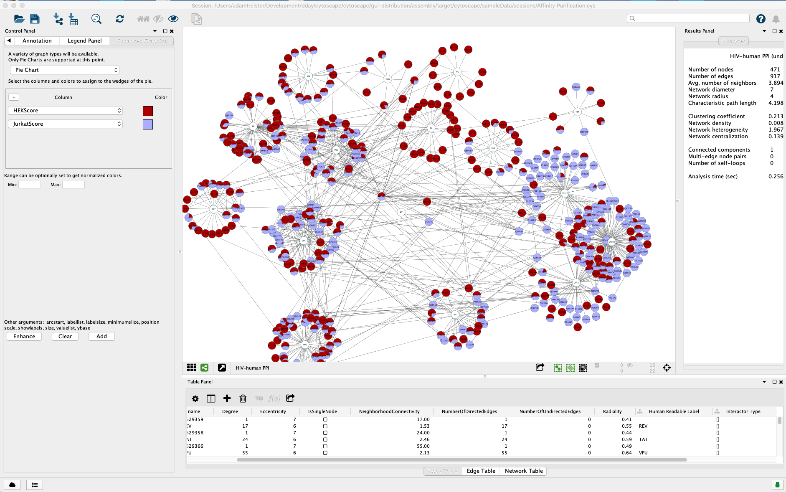

# enhancer

This is the front end to a package called EnhancedGraphics, which adds the 
ability to display charts for each node in the network.

Simple documentation for this can be found at the AppStore page:
(http://apps.cytoscape.org/apps/enhancedgraphics )

More complete explanation of the arguments is available from RBVI
(http://www.rbvi.ucsf.edu/cytoscape/utilities3/enhancedcg.shtml)

### ONLY PIE CHARTS ARE IMPLEMENTED

The first choice box offering multiple graph types is *ignored* in this early release.
Pie charts are rendered *regardless of your setting.*

The wedges of the pie represent node attributes, that is columns in the node table.  In order to add a wedge to a pie chart, you must first create the appropriate columns in the node table browser.

If no range is specified, the data is normalized among the columns included in the pie chart.  To override this option, you can enter specific values for the value range.

Since it is not yet in the App Store, you have to install it manually.   After downloading the jar,

1. Launch Cytoscape,  go to Apps >> App Manager 
2. Click the Install from File… button in the lower left
3. Navigate to the download location.
4. This will added an Enhanced Graphics tab to the Control Panel on left.
